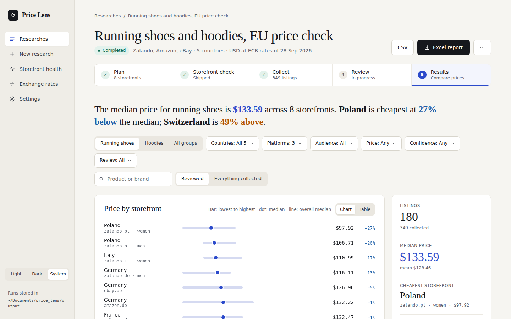

# Price Lens

Price research for consumer products across **Amazon, eBay, Zalando and MediaMarkt**, in up to
70 country storefronts. You describe what to research. The app then:

1. collects the listings in the background;
2. has an AI (or you) weed out irrelevant products;
3. compares prices per country and storefront in US dollars, with an Excel report at the end.



- **Plan a research**: search words per language, audiences (men / women / kids), words to
  leave out, price range and where to search. Or let an AI chat write the plan for you.
- **Collect**: live progress, and **pause / resume** for long runs (even days later, after a
  restart). Internet drops and crashes are handled without losing what was collected.
- **Review**: Claude (with an API key) or any AI chat marks listings as relevant or not, and
  you can overrule any decision by hand.
- **Results**: a plain-language finding, filters, a price chart per storefront, a summary,
  and an Excel report / CSV of exactly what is on screen.
- **Exchange rates**: daily European Central Bank rates, with the option to set your own.
- **Storefront health**: which shops worked the last time, so you can leave out the broken ones.

Everything runs on your own computer. Your research data stays in the `output` folder and is
never uploaded anywhere.

---

## Contents

- [Install on Windows](#install-on-windows)
- [Install on a Mac](#install-on-a-mac)
- [Start the app](#start-the-app)
- [Your first research](#your-first-research)
- [Where your data is](#where-your-data-is)
- [Updating to a new version](#updating-to-a-new-version)
- [Automatic AI review (optional)](#automatic-ai-review-optional)
- [Troubleshooting](#troubleshooting)
- [For developers and AI agents](#for-developers-and-ai-agents)

---

## Install on Windows

You need about 10 minutes and an internet connection.

1. **Install Python** 3.10 or newer from <https://www.python.org/downloads/windows/>.
   In the installer, tick **"Add python.exe to PATH"**. Python 3.12 or 3.13 is a safe choice.
2. **Install Firefox** from <https://www.mozilla.org/firefox/>. The app uses Firefox to visit
   the shops.
3. **Download the app.** On the GitHub page, open **Releases** (right-hand side), pick the
   newest one and download **Source code (zip)**. Unzip it to a folder of your choice, for
   example `Documents\price_lens`.
   *Tip: avoid folders synced by OneDrive if you can. Syncing can briefly lock files while the
   app writes them. (The app copes with this, but a local folder is faster.)*
4. **Run the setup.** Double-click **`setup_windows.bat`** in that folder. It creates a
   private Python environment (`.venv`), installs everything and ends with a check. All lines
   should say `PASSED`.

## Install on a Mac

1. **Install Python** 3.10 or newer from <https://www.python.org/downloads/macos/>. The Python
   that comes with macOS is too old. (Homebrew's `python@3.12` works too.)
2. **Install Firefox** from <https://www.mozilla.org/firefox/> and move it into *Applications*.
3. **Download the app.** On the GitHub page, open **Releases**, download **Source code (zip)**
   of the newest release, and unzip it, for example into your *Documents* folder.
4. **Run the setup.** Double-click **`setup_mac.command`**.
   - The first time, macOS may say it *"cannot be opened because it is from an unidentified
     developer"*. Right-click (or Control-click) the file, choose **Open**, then **Open** again.
     You only need to do this once per file.
   - If it says *"permission denied"* or opens in a text editor, open **Terminal**, type
     `cd ` (with a space), drag the project folder into the Terminal window, press Return, then
     run: `chmod +x *.command` and double-click the file again.

   The setup creates a private Python environment (`.venv`), installs everything and ends
   with a check. All lines should say `PASSED`.

## Start the app

| | Windows | Mac |
|---|---|---|
| **Start** | double-click `start_new_app.bat` | double-click `start_new_app.command` |
| **Stop** | close the black window | close the Terminal window |

Your browser opens the app at <http://127.0.0.1:8765>. Keep the small window open while you
work. The app only accepts connections from your own computer.

A collection keeps running in the background even if you close the browser tab. Open the app
again to see how it is doing.

The previous app (Streamlit) is kept as a fallback: `start_app.bat` / `start_app.command`. Both
apps read and write the same `output` folder.

## Your first research

1. **New research** (left sidebar). Give it a name and describe what you want to find out.
2. **Search for** a product, for example `running shoes`. Use **Quick setup** to pick a product
   type and a group of countries, or choose platforms and countries yourself under
   *Where to search*.
3. Check the **search words per language**. Countries without a local word are flagged, and
   *Suggest translations* fills in the words to leave out (such as *socks*) in every language.
4. Optional: **Test the storefronts first**. This opens one page per shop and tells you which
   ones work today.
5. **Start collecting.** Large runs can take hours. **Pause** whenever you like, and use
   **Resume collecting** later to collect only what is still missing.
6. **Review** (optional but recommended): let Claude or any AI chat mark irrelevant listings,
   then *Apply review*.
7. **Results**: filter, compare and download the **Excel report**.

Plans can also be written by an AI chat: *New research → Plan with an AI chat* gives you a
prompt to paste into ChatGPT, Claude or similar. Paste the answer back with *Import plan*.

## Where your data is

Everything the app collects is in the **`output`** folder inside the project folder:

| What | Where |
|---|---|
| One folder per research | `output/analyst_…` (listings, Excel files, review, log) |
| Drafts | `output/drafts/` |
| Your own exchange rates | `output/fx_manual.json` |
| Default settings | `output/app_settings.json` |

The `output` folder is **not** part of the GitHub project, so your data is never uploaded.
To move your work to another computer, copy the `output` folder into the project folder
there. The project folder itself can be moved or renamed freely.

## Updating to a new version

1. Download the newest release (see the installation steps) and unzip it to a **new** folder.
2. Copy your **`output`** folder from the old folder into the new one.
3. Run the setup once more in the new folder (`setup_windows.bat` / `setup_mac.command`).
4. Start the app from the new folder. Once everything looks right, you can delete the old
   folder.

If you work with git: `git pull`, then run the setup again when `pyproject.toml` has changed.

## Automatic AI review (optional)

Without an API key you can still review with any AI chat by copy and paste: the app prepares
the prompts and reads the answers. To let Claude review automatically, give the app an
Anthropic API key:

- **Windows:** press Start and search for *"Edit environment variables for your account"*.
  Add a new variable named `ANTHROPIC_API_KEY` with your key as the value, then restart the app.
- **Mac:** open Terminal and run
  `echo 'export ANTHROPIC_API_KEY="your-key"' >> ~/.zshrc`, then restart the app.

*Settings* shows whether the key was found. Optional: `PI_REVIEW_MODEL` chooses the Claude
model. Never put a key into a file inside the project folder.

## Troubleshooting

| Problem | What to do |
|---|---|
| The setup check says **Firefox FAILED** | Install Firefox (on a Mac, into *Applications*) and run the setup again. |
| **"Python was not found"** / *"Python 3.10 or newer was not found"* | Install Python from python.org (on Windows with "Add to PATH" ticked), then run the setup again. |
| The browser does not open | Open <http://127.0.0.1:8765> yourself. If another copy of the app is already running, the new one just opens that one. |
| A shop returns nothing or shows **Bot check** | Shops sometimes block automated visits for a while. Try again later with *Retry* on the Collect step, or leave the shop out (Storefront health shows which ones fail). |
| **Cookie wall** or **Redirect** | Usually temporary. *Test the storefronts first* before a large run. |
| The internet dropped during a run | Nothing to do: the run waits up to 15 minutes, then continues. Storefronts it could not reach are listed under *Retry*. |
| The computer slept, crashed or was shut down during a run | Open the research: everything collected so far is recovered, and *Resume collecting* continues from there. |
| *"File in use by another program"* | Close the file in Excel (or wait for OneDrive to finish syncing) and try again. |
| Mac: *"unidentified developer"* or *"permission denied"* | See step 4 of [Install on a Mac](#install-on-a-mac). |

## For developers and AI agents

- **Developer guide**: how the program works, the important files, debugging, and how to
  make common changes. See [docs/DEVELOPER_GUIDE.md](docs/DEVELOPER_GUIDE.md). **Start here
  if you take over the project.**
- **Technical reference**: command line, JSON plan format, AI-agent workflow, result fields,
  scrapers. See [docs/TECHNICAL.md](docs/TECHNICAL.md).
- **AI agents** (Claude Code, Copilot, …) doing research from the command line follow
  [agent/SKILL.md](agent/SKILL.md).
- **Maintaining the GitHub project**: first upload, moving computers, daily changes and
  making a release. See [docs/MAINTAINING.md](docs/MAINTAINING.md).
- **Changes per version**: [CHANGELOG.md](CHANGELOG.md).

### Project layout

```text
price_lens/
├── start_new_app.bat / .command   start the app
├── setup_windows.bat / setup_mac.command
├── start_app.bat / .command       previous (Streamlit) app, kept as a fallback
├── price_lens.bat       command line (Windows)
├── src/price_lens/
│   ├── webapp/                    the app: local web server (server.py), API (api.py), pages (static/)
│   ├── orchestrator/              plans, background runs, pause/resume, retries, reports
│   ├── marketplaces/              one scraper per platform (Amazon, eBay, Zalando, MediaMarkt)
│   ├── agent/                     AI relevance review
│   └── core/                      cleaning, currencies and exchange rates, export, validation
├── apps/                          the previous Streamlit app
├── agent/                         instructions and schemas for AI agents
├── examples/                      example plans
├── tests/                         automated tests
└── output/                        your research data (not in git)
```

### Running the tests

```bash
# Windows
.venv\Scripts\python -m pip install pytest
.venv\Scripts\python -m pytest

# Mac
.venv/bin/python -m pip install pytest
.venv/bin/python -m pytest
```

The tests use saved pages and fake scrapers. They never visit the real shops.
